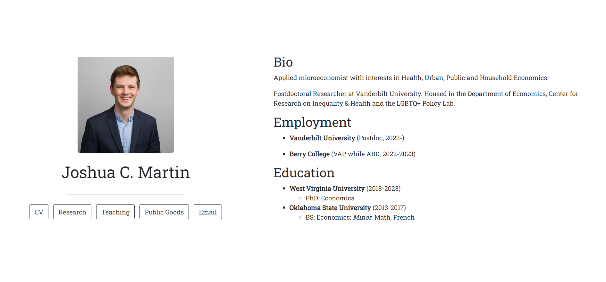

# Website

A [Quarto](https://quarto.org/) template for creating an academic website. Created using the Sean Kross' [postcards package](https://github.com/seankross/postcards).

## Example

Below is an example of my own personal website as of 10/23/23. Click the picture to visit an updated version of the website.

  
[Source Code](https://github.com/joshmartinecon/joshmartinecon.github.io/blob/main/index.Rmd)
