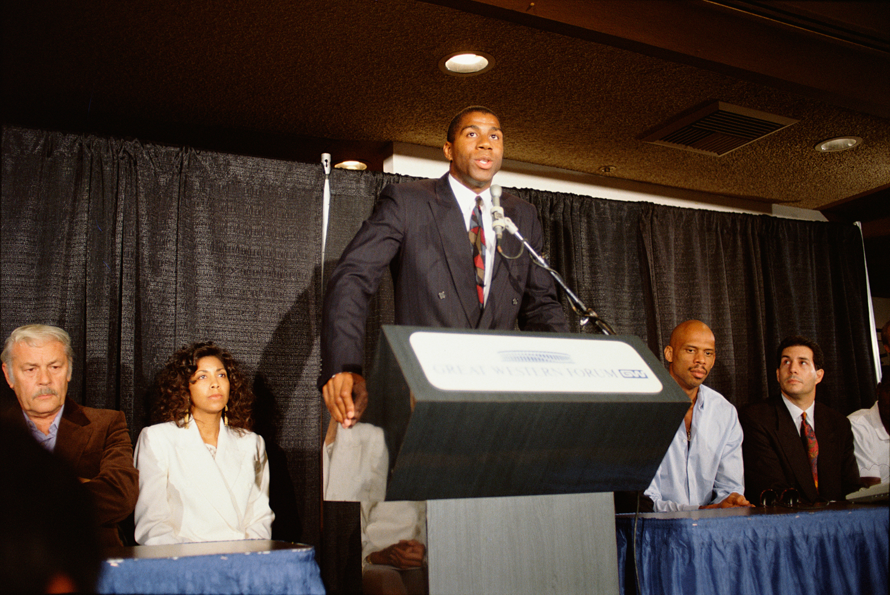
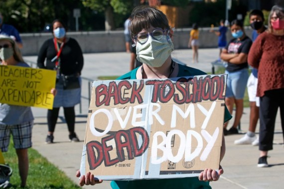
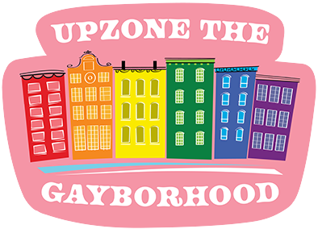

[Home](https://joshmartinecon.github.io/) | [CV](https://github.com/joshmartinecon/quarto-cv/blob/main/joshmartin_cv.pdf) | [Research](https://joshmartinecon.github.io/research.html) | [Teaching](https://joshmartinecon.github.io/teaching.html) | [GitHub](https://github.com/joshmartinecon?tab=repositories)

---

### <ins>**Publications**<ins>

<!--- Publication 1 --->

  

  
  

  

  

	
 <a style="margin:0; font-size:125%; font-weight:bold"
			href="https://doi.org/10.1002/hec.4712">
			Information Shocks and Celebrity Exposure: The Effect of “Magic” Johnson on AIDS Diagnoses and Mortality in the U.S.
			</a>   with [Alexander Cardazzi](https://alexcardazzi.github.io/) and [Zachary Rodriguez](https://sites.google.com/view/zacharyrodriguez/home); *Health Economics* (2023)
			

  <button class="accordion-btn">Abstract</button>
  
 
 We present evidence that Earvin “Magic” Johnson's announcement that he contracted HIV served as a public-health catalyst for rapidly correcting the public's understanding of who was at risk of infection. Using a novel identification strategy, we present evidence that there was a large but temporary increase in the number of AIDS diagnoses for heterosexual men following the announcement. This effect was concentrated in areas with greater prior exposure to Johnson. We show that these men were both more likely to have been diagnosed via a formal blood test and less likely to die within 1 decade of their initial diagnosis—suggesting that Johnson's announcement caused an intertemporal substitution in testing which prolonged patients' lifespans as a result of earlier access to medical care. We estimate that Johnson's announcement caused approximately 800 additional heterosexual males in the United States in metropolitan statistical areas with National Basketball Association franchises men to discover their underlying AIDS diagnosis and, of whom, were more likely to live at least 1 decade beyond their initial diagnosis date. 

  

  

<!--- Publication 2 --->

  

  
  

  

  

	
 <a style="margin:0; font-size:125%; font-weight:bold"
			href="https://doi.org/10.1080/15582159.2022.2132589">
			Determinants of Voting on Education Savings Accounts: Evidence from Tennessee
			</a>   with Ben Luikart and [Joshua C. Hall](https://sites.google.com/site/joshuachall/); *Journal of School Choice* (2022)
			

  <button class="accordion-btn">Abstract</button>
  
 
 Tennessee passed voucher-style Education Savings Account (ESA) legislation in 2019. We analyze the roll call vote in the Tennessee House to better understand the role of constituent, legislator, and special interest influences on support for school choice. This is accomplished using a binary probit model with legislator vote as the dependent variable. We find that legislator voting behavior in this context is most significantly determined by party affiliation and the presence of campaign funding from the Tennessee Education Association (TEA) rather than the demographic characteristics of their constituents. 

  

  

<!--- Publication 3 --->

  

  
  

  

  

	
 <a style="margin:0; font-size:125%; font-weight:bold"
			href="https://doi.org/10.3390/economies8040089">
			The Impact of the New York City Marathon on Hotel Demand
			</a>   with [Joshua C. Hall](https://sites.google.com/site/joshuachall/); *Economies* (2020)
			

  <button class="accordion-btn">Abstract</button>
  
 
 Daily hotel data are employed, along with information on prices, revenue, demand and hotel occupancy, to analyze part of the local economic impact of the annual New York City (NYC) Marathon. As the largest competitive race in the world, the marathon attracts domestic and international competitors and spectators. The cancellation of the 2012 marathon due to Hurricane Sandy was estimated to lead to an increase of 4000 hotel nights as well as a 10% increase in the average daily room rate. Taken together, this is associated with a USD 3 million increase in hotel revenue. The results suggest a significantly lower local economic impact of the race than previously thought. 

  

  

### <ins>**Working Papers**<ins>

<!--- Working Paper 1 --->

  

  
  

  

  

	
 <a style="margin:0; font-size:125%; font-weight:bold"
			href="https://github.com/joshmartinecon/joshmartinecon.github.io/blob/main/research/working%20papers/ssm%20adoptions.pdf">
			The Effect of Same-Sex Marriage Legalization on Adoptions and Family Formation
			</a>   with [Zachary Rodriguez](https://sites.google.com/view/zacharyrodriguez/home); *Under Review*
			

  <button class="accordion-btn">Abstract</button>
  
 
 The stability and availability of legal rights are known to be crucial factors influencing investment decisions. In this paper, we extend this framework to the family by estimating the impact of same-sex marriage (SSM) legalization on the demand for households’ most significant investment – children. To do so, we employ a stacked difference-in-differences estimator, which leverages the differential timing of these laws across states. Using highly detailed, case-level data of nearly 20 million children in the foster care system from 1995-2019, we demonstrate that SSM led to substantial increases in the annual number of adoptions. Same-sex households drive this effect. Secondary analyses highlight the role of uncertainty reductions as an important mechanism – particularly through these laws’ granting of presumptive joint parental rights. 

  

  

<!--- Working Paper 2 --->

  

  
  

  

  

    

        Sexual Orientation, Sexual Attraction, and Income
    

    with [Christopher S. Carpenter](https://sites.google.com/site/kittcarpenter/) and [Hasan Shahid](https://www.hasanshahidecon.com/); *Under Review*
			

  <button class="accordion-btn">Abstract</button>
  
 
 We provide new evidence on sexual orientation, sexual attraction, and income using data from the 2015-21 National Survey on Drug Use and Health (NSDUH). These data ask individuals about both orientation and attraction, allowing us to describe a sexual minority group that has been hidden in prior research: people who identify as heterosexual but who concurrently report some same-sex attraction. We show that this population is much larger than the sample of self-identified gay, lesbian, or bisexual people, and we show that relative to heterosexual people who report exclusively different-sex attraction, heterosexual people who report some same-sex attraction are younger, less likely to be married, and much more highly educated. We document that, controlling for observables, heterosexual men who report same-sex attraction experience robust and statistically significant employment and income penalties relative to heterosexual men who are exclusively different-sex attracted. These penalties are larger for non-Hispanic White men than for non-Hispanic Black men. We find no similar penalty for heterosexual women who report same-sex attraction. Our results indicate that prior research has overlooked one of the largest groups of sexual minorities – heterosexual people who report some same-sex attraction – who experience systematically different economic outcomes than heterosexual individuals who are exclusively different-sex attracted. 

  

  

<!--- Working Paper 3 --->

  

  
  

  

  

    

        Does Love Kill Speed? The Effect of Marriage on Formula One Driver Performance
    

    with [Clay Collins](https://www.claygcollins.com/); *Under Review*
			

  <button class="accordion-btn">Abstract</button>
  
 
 This paper provides an empirical test of how life events, in this case, marriage, can affect player performance in a high-risk environment. Using hand-collected data on the marital status of Formula One drivers, we test whether married drivers take fewer risks and drive more conservatively during qualifying periods. Using a variety of estimation methods to test short- and long-term effects of changes in marital status, we find no evidence that ``love is the enemy of speed''. Married drivers see no changes in performance after their wedding dates, nor are they discriminated against and exit the sport earlier. 

  

  

### <ins>**Works in Progress**<ins> 

<!--- Working Paper 1 --->

  

  
  

  

  

	
 <a style="margin:0; font-size:125%; font-weight:bold"
			href="https://github.com/joshmartinecon/joshmartinecon.github.io/blob/main/research/working%20papers/school%20reopenings.pdf">
			Spatial Endogeniety \& School Reopenings during the COVID-19 Pandemic
			</a>  
			

  <button class="accordion-btn">Abstract</button>
  
 
 This paper explores the role that teacher union strength played in the reopening decisions of public schools in Connecticut throughout the '20-'21 academic school year. To do so, I construct a measure of union strength that combines the number of pages in a union's collective bargaining agreement with a text analysis that measures the expansiveness of their contract's leave policies. I find that school districts with strong unions were less likely to offer in-person classes throughout the 2020-2021 academic year. However, this effect becomes insignificant when accounting for the local incidence of COVID-19. Instead, I find that differences in the vote share of the democratic presidential nominee of 2020 and the number of COVID-19 cases were stronger predictors of reopening decisions. The results contradict the consensus within the literature that unions and political attitudes prevented schools from reopening. These results suggest that using more geographically granular data and a longer time horizon to define reopening decisions describes the differences in results. 

  

  

<!--- Working Paper 2 --->

  

  
  

  

  

    

        Peer Health Shocks, Opportunity Costs, and Compensating Differentials: Evidence from of Professional Athletes
    

    [Previous Version](https://github.com/joshmartinecon/joshmartinecon.github.io/blob/main/research/working%20papers/cte%20and%20retirement.pdf)
			

  <button class="accordion-btn">Abstract</button>
  
 
 Extensive research has documented an inverse relationship between workers’ wages and the overall desirability of their workplace. This paper extends this framework to examine how workers respond to peer health shocks related to continued workplace participation under conditions of monopsony power. By leveraging exogenous assignment of workers to different firms within the National Football and Hockey Leagues, I analyze differences in the employment outcomes of characteristically similar athletes who differ only in their exposure to a coworker who died of chronic traumatic encephalopathy. I demonstrate that football players negotiate shorter contracts following this exposure but are not immediately less likely to retire whereas treated hockey players see sharp increases in retirement. The differences in these labor supply responses are driven by athletes’ opportunity costs such as expected foregone earnings and college degree completion. Neither the length of time as coworkers, specialization similarities, nor the number of prior workplace injuries provide additional explanatory power. 

  

  

<!--- Working Paper 3 --->

  

  
  

  

  

    

        Do Childcare Costs Reduce Fertility? Evidence from Same-Sex Marriage
			

  <button class="accordion-btn">Abstract</button>
  
 
 A growing body of research has documented the growing gap between individuals' idealized and realized fertility outcomes in high-income countries. This paper contributes to this literature by analyzing how childcare costs constrain fertility in the United States. To do so, I combine a novel measure of local childcare cost burden with county-level estimates from a triple difference model, which measures changes in the number of children within the household due to same-sex marriage legalization (SSM). The results demonstrate that childcare costs significantly reduce the number of children within the household. Extensive margin changes drive this effect, revealing that the cost of raising children is significantly more binding for the fertility decisions for subsequent children than for first-borns. 

  

  

<!--- Working Paper 4 --->

  

  
  

  

  

    

        Chasing Rainbows: Same-Sex Marriage, Migration, and Housing Prices in American Gayborhoods
    

    with [João Tampellini](https://www.joaotampellini.com/)
			

  <button class="accordion-btn">Abstract</button>
  
 
 Social scientists have long studied the residential enclaves of minoritized groups. This paper examines changes in estimated amenity values within American gayborhoods using geographically localized data over 60 years. We use a difference-in-differences design comparing gayborhoods to adjacent neighborhoods within the same city and document that the rent-to-income ratio for these neighborhoods is v-shaped over time – declining largely during the peak of the AIDS crisis in the 1990s before sharply rebounding in the 2010s. To better understand the factors impacting this increase, we exploit the staggered treatment timing of same-sex marriage laws across states. We find that marriage equality laws increase both the number and share of different-sex households residing within the gayborhood which drives up the price of housing. This increase in the price of housing displaces renters in cities with inelastic housing supply. 

  

  

