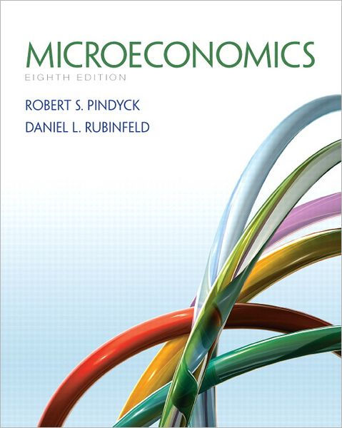
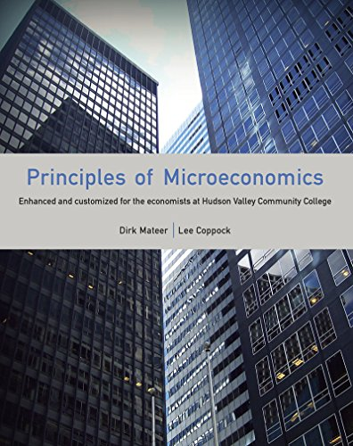

[Home](https://joshmartinecon.github.io/) | [CV](https://github.com/joshmartinecon/quarto-cv/blob/main/joshmartin_cv.pdf) | [Research](https://joshmartinecon.github.io/research.html) | [Teaching](https://joshmartinecon.github.io/teaching.html) | [GitHub](https://github.com/joshmartinecon?tab=repositories)

---

### <ins>**Instructor of Record**<ins>

  

  
  

  

  

    Urban & Regional Economics (ECO 490) 
    Syllabus: 
    <a href="https://github.com/joshmartinecon/joshmartinecon.github.io/blob/main/teaching/syllabi/2022Spring_ECO490_syllabus.pdf">Spring 2022</a>

  <button class="accordion-btn">Course Description</button>
  
 
 Urban & Regional Economics utilizes economic theory and real-world examples to examine major contemporary issues confronting urban and rural areas. At the most basic level, U&R Economics introduces space into economic models and studies the location of economic activity. The course will introduce theories of why cities exist, city location, city size, and the causes of city growth and decline. The course will also explore possible economic solutions to problems associated with housing, transportation, education, employment, pollution, and crime. 

  

  

  

  
  

  

  

    Applied Economic Research (ECON 482) 
    Syllabus: 
    <a href="https://github.com/joshmartinecon/joshmartinecon.github.io/blob/main/teaching/syllabi/2021Fall_ECON482_syllabus.pdf">Fall 2021</a>

  <button class="accordion-btn">Course Description</button>
  
 
 This course is designed to introduce West Virginia University Economics students to Applied Economics research. Students will be exposed to applications of popular methods and studied subfields within Economics through published research. The course will cumulate with the completion and presentation of a major research project. 

  

  

  

  
  

  

  

    Intermediate Microeconomic Theory (ECON 301) 
    Syllabus: 
    <a href="https://github.com/joshmartinecon/joshmartinecon.github.io/blob/main/teaching/syllabi/2021Fall_ECON301_syllabus.pdf">Fall 2021</a>

  <button class="accordion-btn">Course Description</button>
  
 
 Intermediate Microeconomic Theory is designed to extend your knowledge of basic microeconomic principles introduced in Econ 201. Microeconomics studies the behavior of individual consumers, firms, and other economic agents that influence markets, such as the government. Using economic theories and models to study the behavior of economic agents helps us to better understand contemporary real world economic and business issues, as well as personal issues.

The course begins with basic concepts of the market: supply, demand and market equilibrium. We then look at principles underlying consumer choices and individual and market demand. Next we consider individual firm behavior including profit maximization and cost minimization under perfect competition. We then evaluate the welfare effects of various government interventions in perfectly competitive markets such as price ceilings, price floors, taxes and subsidies. We conclude with a look at pricing with market power. 

  

  

  

  
  

  

  

    Principles of Microeconomics (ECON 201) 
    Syllabi: 
    <a href="https://github.com/joshmartinecon/joshmartinecon.github.io/blob/main/teaching/syllabi/2021Spring_ECON201_syllabus.pdf">Spring 2021</a>, 
    <a href="https://github.com/joshmartinecon/joshmartinecon.github.io/blob/main/teaching/syllabi/2020Summer_ECON201_syllabus.pdf">Summer 2020</a>

  <button class="accordion-btn">Course Description</button>
  
 
 This course is designed to introduce WVU students to the principles of microeconomics. Microeconomics is the study of the behavior of individual economic units, such as households and business firms, and of their interactions in markets. Almost 100 years ago, the economist Alfred Marshall described microeconomics as the study of men and women in the "everyday business of life". 

  

  

  

  
  

  

  

    Markets & Society (ECO 110) 
    Syllabi: 
    <a href="https://github.com/joshmartinecon/joshmartinecon.github.io/blob/main/teaching/syllabi/2023Spring_ECO110_syllabus.pdf">Spring 2023</a>, 
    <a href="https://github.com/joshmartinecon/joshmartinecon.github.io/blob/main/teaching/syllabi/2022Fall_ECO110_syllabus.pdf">Fall 2022</a>,
    <a href="https://github.com/joshmartinecon/joshmartinecon.github.io/blob/main/teaching/syllabi/2022Spring_ECO110_syllabus.pdf">Spring 2022</a>

  <button class="accordion-btn">Course Description</button>
  
 
 A principles level economics course analyzing how markets determine prices and the role of the price system in society. Examination of rationales for and limitations to government regulation of human interaction in markets. Introduction of the factors that determine macroeconomic activity and economic growth. Discussion of the American financial system and international trade. Consistent with its inclusion in the College's general education curriculum, this course emphasizes economic literacy for understanding historical and current events. 

  

  

### <ins>**Teaching Assistant**<ins>

  

  
  

  

  

        Advanced Economic Theory I & II
    

    Spring 2021 with Prof. <a href="https://sites.google.com/site/kolereddig">Kole Reddig</a>

    Fall 2021 with Prof. <a href="https://sites.google.com/site/bryancmccannon/">Bryan McCannon</a>

    Spring 2020 with Prof. <a href="https://community.wvu.edu/~shnishioka/">Shuichiro Nishioka</a>

  

  

  
  

  

  

        Intermediate Microeconomic Theory
    

    Fall 2019 with Prof. <a href="https://sites.google.com/view/danielgrossman/home">Dan Grossman</a>

  

  

  
  

  

  

        Principles of Macroeconomics
    

    Spring 2019 with Prof. <a href="https://sites.google.com/view/margaretbock">Margret Bock</a>

  

  

  
  

  

  

        Principles of Microeconomics
    

    Fall 2018 with Prof. <a href="https://sites.google.com/site/collinhodges/home">Collin Hodges</a>

  

### <ins>**Guest Lectures**<ins>

#### *2024*

    <a href="https://github.com/joshmartinecon/joshmartinecon.github.io/tree/main/teaching/lectures/Vanderbilt/PPS%203250%20Guest%20Lecture%202.21.24">Advanced Quantitative Methods for Public Policy</a>

    <a href="https://github.com/joshmartinecon/joshmartinecon.github.io/tree/main/teaching/lectures/Vanderbilt/GSS%201160%20Guest%20Lecture%203.4.24">Sex and Society</a>

