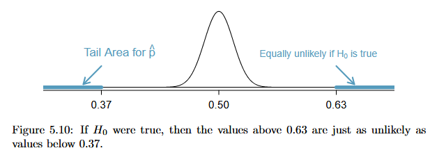

# Unit 2 Notes | Statistics for Business II

## Intro to Probability

- The **probability** of an outcome is the proportion of times the outcome would occur if we observed the random process an infinite number of times.
- Probability is a **long-run proportion**, so it always lies between 0 and 1.

## Law of Large Numbers (LLN)

- Example: rolling a fair die many times.
  - Let $\hat{p}_n$ be the proportion of rolls that equal 1 after $n$ rolls.
  - As $n$ increases, $\hat{p}_n \rightarrow p = \frac{1}{6}$.
  
- The **Law of Large Numbers** states that as the number of observations increases, the sample proportion $\hat{p}_n$ of an outcome converges to the true probability $p$.

- In small samples, the sample proportion may appear to "defy" the Law of Large Numbers.
  - These deviations are normal due to randomness.
  - As the number of observations grows, the deviations become smaller and the proportion stabilizes around $p$.

```{r}
# Draw one value from 1 through 6
# This simulates rolling a fair six-sided die once
# 1:6 → possible outcomes (the faces of the die)
# size = 1 → number of rolls
# replace = TRUE → allows the same number to appear again in future rolls

sample(1:6, size = 1, replace = TRUE)

# True probability of rolling a 1 with a fair die
p <- 1/6

# Set seed once for reproducibility
set.seed(123)

# Create an empty list to store simulation results
z <- list()

# Repeat the experiment for n = 1 to 5000 rolls
for(i in 1:5000){
  
  # Simulate i die rolls and store results in a data frame
  # number of rolls (n)
  # rolls = outcomes from rolling a fair die i times
  z[[length(z)+1]] <- data.frame(
    n = i,
    rolls = sample(1:6, i, replace = TRUE)
  )
  
}

# Combine all stored data frames into one large data frame
z <- as.data.frame(do.call(rbind, z))

# Create indicator variable:
# 1 if roll equals 1, 0 otherwise
z$one <- ifelse(z$rolls == 1, 1, 0)

# View first few rows
head(z)

# For each value of n, compute the proportion of 1s
# This gives us the sample proportion p-hat_n
y <- aggregate(one ~ n, data = z, mean)

# View first few results
head(y)

# Plot sample proportion against number of rolls
par(mar = c(5, 5, 1, 1))
plot(y$n, y$one,
     xlab = "number of rolls (n)", 
     ylab = expression(hat(p)[n]),
     cex.lab = 1.5, 
     cex.axis = 1.25, 
     ylim = c(0, 2*p), 
     col = "darkblue", 
     pch = 19)
abline(h = p, lwd = 4, col = "plum")
legend("topright", 
       legend = c("True Value"),
       lwd = 4, col = "plum", 
       bty = "n", cex = 1.5)

```

## Disjoint (Mutually Exclusive) Outcomes

- Two outcomes are **disjoint** (or **mutually exclusive**) if they cannot occur at the same time.
  - When rolling a die, the outcomes 1 and 2 are disjoint — only one number can appear.
  - However, the outcomes 1 and “rolling an odd number” are **not** disjoint, since both occur when the roll is 1.

- If outcomes are disjoint, we can calculate the probability of either occurring by **adding their probabilities**.

$$
P(1 \text{ or } 2) = \frac{1}{6} + \frac{1}{6} = \frac{2}{6} = \frac{1}{3}
$$

### Addition Rule for Disjoint Outcomes

- If $A_1, A_2, \dots, A_k$ are disjoint events, then:

$$
P(A_1 \text{ or } A_2 \text{ or } \dots \text{ or } A_k)
= P(A_1) + P(A_2) + \dots + P(A_k)
$$

### Thinking in Terms of Events

- In practice, we often work with **events**, which are sets (collections) of outcomes.

- Let:
  - $A = \{1, 2\}$ (rolling a 1 or 2)
  - $B = \{4, 6\}$ (rolling a 4 or 6)

- Because $A$ and $B$ share no outcomes, they are **disjoint events**.

$$
P(A \text{ or } B) = P(A) + P(B)
= \frac{2}{6} + \frac{2}{6}
= \frac{4}{6}
= \frac{2}{3}
= 0.\bar{6}
$$

```{r}

set.seed(123)
z <- list()
for(i in 1:10000){
  z[[i]] <- sample(1:6, size = 1, replace = TRUE)
}

z <- unlist(z)
A <- ifelse(z == 1 | z == 2, 1, 0)
B <- ifelse(z == 4 | z == 6, 1, 0)

mean(A) + mean(B)

```

## When Events Are *Not* Disjoint

- Probability a randomly selected card is a diamond:

$$
P(\diamondsuit) = \frac{13}{52} = \frac{1}{4} = 0.25
$$

- Probability a randomly selected card is a face card:

$$
P(\text{face}) = \frac{12}{52} \approx 0.23
$$

- Probability a card is a **face card or a diamond**:

These events overlap (there are 3 face cards that are diamonds), so we must subtract the overlap:

$$
P(\text{face or } \diamondsuit)
= P(\text{face}) + P(\diamondsuit) - P(\text{face and } \diamondsuit)
$$

$$
= \frac{12}{52} + \frac{13}{52} - \frac{3}{52}
= \frac{22}{52}
\approx 0.42
$$

```{r}

z <- data.frame(
  number = rep(2:14, 4),
  suit = rep(c("d", "c", "s", "h"), 13)
)
head(z)

y <- list()
for(i in 1:10000){
  set.seed(i)
  z$order <- rnorm(n = 52)
  z <- z[order(z$order),]
  
  y[[length(y)+1]] <- data.frame(
    loop = i,
    true = ifelse(z[1,2] == "d" | z[1,1] %in% 11:13, 1, 0)
  )
}
y <- as.data.frame(do.call(rbind, y))
mean(y$true)


```

### General Addition Rule

- For **any** two events $A$ and $B$ (disjoint or not):

$$
P(A \text{ or } B)
= P(A) + P(B) - P(A \text{ and } B)
$$

- The term $P(A \text{ and } B)$ accounts for overlap.
- If $A$ and $B$ are disjoint, then:

$$
P(A \text{ and } B) = 0
$$

and the rule simplifies to simple addition.

## Probability Distribution

- A **probability distribution** lists all possible disjoint outcomes and their associated probabilities.

- For a valid probability distribution:
  - Outcomes must be **disjoint**.
  - Each probability must be between 0 and 1.
  - The probabilities must sum to **1**.

```{r}

set.seed(124)

x <- data.frame(
  dice1 = sample(1:6, 10000, replace = TRUE),
  dice2 = sample(1:6, 10000, replace = TRUE)
)

sum <- x$dice1 + x$dice2
t <- as.data.frame(table(sum))
head(t)

y <- data.frame(
  sum = t$sum,
  prob = t$Freq / sum(t$Freq)
)

par(mar = c(5, 5, 1, 1))
barplot(height = y$prob, names = y$sum,
        ylim = c(0, 0.2),
        xlab = "Dice Sum", ylab = "Probability",
        cex.axis = 1.25, cex.lab = 1.5, cex.names = 1.25,
        col = "darkblue")

```

## Independence

- Two processes (or events) are **independent** if knowing the outcome of one provides no information about the outcome of the other.
  - Example: Flipping a coin and rolling a die are independent — knowing the coin landed heads tells us nothing about the die roll.
  - In contrast, stock prices often move together, so their movements are typically **not** independent.

### Multiplication Rule for Independent Events

- If $A$ and $B$ are independent events, then the probability that **both** occur is:

$$
P(A \text{ and } B) = P(A) \times P(B)
$$

- More generally, if $A_1, A_2, \dots, A_k$ are independent events, then:

$$
P(A_1 \text{ and } A_2 \text{ and } \dots \text{ and } A_k)
= P(A_1) \times P(A_2) \times \dots \times P(A_k)
$$

### Example: Rolling Two Dice

- What is the probability of rolling two 1s?

$$
P(1 \text{ and } 1)
= \frac{1}{6} \times \frac{1}{6}
= \frac{1}{36}
= 0.02\bar{7}
$$

```{r}

x$ones <- ifelse(x$dice1 == 1 & x$dice2 == 1, 1, 0)
mean(x$ones)

```

## Marginal and Joint Probabilities

- **Marginal probabilities** are the probabilities based on a single variable without regard to any other variables

- A probability of outcomes for two or more variables or processes is called a **joint probability**

### Example: Photo Classification

- Data scientists are developing a classifier to determine whether a photo is related to fashion.
  - The `photo_classify` dataset contains 1,822 photos from a photo-sharing website

- Each photo receives **two classifications**:
  - `mach_learn`: the binary prediction from a machine learning model
  - `truth`: a binary human-reviewed classification

- We treat the human classification (`truth`) as the **ground truth** when evaluating model performance.

```{r}

x <- read.csv("data/photo_classify.csv")

table(x$mach_learn)
table(x$truth)

z <- as.data.frame.matrix(table(predicted = x$mach_learn, actual = x$truth))
z$total <- rowSums(z)
z <- rbind(z, total = colSums(z))
z

```

- What is the probability that the machine algorithm will classify a picture as being about fashion?
  - $\dfrac{219}{1822} \approx 12\%$
  
```{r}

mean(ifelse(x$mach_learn == "pred_fashion", 1, 0))

```

- What is the probability that:
  - the machine algorithm will classify a picture as being about fashion *and* 
  - what is the probability that picture is about fashion?
    - $P(\hat{Fashion} \text{ and } Fashion) = \dfrac{197}{1822} \approx 10.8\%$
    
```{r}

mean(ifelse(x$mach_learn == "pred_fashion" & x$truth == "fashion", 1, 0))

```

## Conditional Probability

- **Conditional probability** measures the probability that an event occurs **given that** another event is known to have occurred.

- A conditional probability has two parts:
  - The event of interest ($A$)
  - The condition ($B$)

- Think of the condition as information we already know to be true.

- Notation:

$$
P(A \mid B)
$$

- Read as: "the probability that $A$ occurs given that $B$ has occurred."

### Example: Photo Classification

- Conditional upon the machine learning prediction that the picture is about fashion, what is the probability that the picture is truly about fashion?
  - $P(Fashion|\hat{Fashion}) = \dfrac{197}{219} \approx 90\%$
  
```{r}

x_predf <- x[x$mach_learn == "pred_fashion",]
mean(ifelse(x_predf$truth == "fashion", 1, 0))

```

- Conditional upon the picture is truly being about fashion, what is the probability that the machine learning estimation predicted that the picture is about fashion?
  - $P(\hat{Fashion}|Fashion) = \dfrac{197}{309} \approx 63.8\%$
  
 Takeaways: this measures **model precision**
  - When the algorithm predicts that a picture is about fashion, it is correct about 90% of the time
  - In practice, this means that the model’s positive predictions are usually trustworthy
  - False positives are relatively rare
  
```{r}

x_f <- x[x$truth == "fashion",]
mean(ifelse(x_f$mach_learn == "pred_fashion", 1, 0))

```

- Takeaways: this measures **model sensitivity**
  - Out of all the pictures that are truly about fashion, the model successfully identifies about 64% of them
  - In practice, this means the model misses a fair number of true fashion images
  - False negatives are fairly common
  
- The model is **conservative**: when it predicts "fashion," it is usually correct (high precision).

- However, it is **incomplete**: it fails to identify a substantial share of true fashion images (moderate sensitivity).

- In short, the algorithm is strong at being right when it predicts fashion, but weaker at capturing all fashion-related content.

### Equations: Conditional Probability

$$
P(A|B) = \dfrac{P(A \text{ and } B)}{P(B)}
$$

- Note that we can rewrite this equation using algebra:

$$
P(A \text{ and } B) = P(A|B) \times P(B)
$$  

$$
P(Fashion|\hat{Fashion}) = \dfrac{P(Fashion \text{ and } \hat{Fashion})}{P(\hat{Fashion})} = \dfrac{0.108}{0.120} \approx 90\%
$$

### Example: Smallpox Vaccine

- The smallpox data set provides a sample of 6,224 individuals from the year 1721 who were exposed to smallpox in Boston
  - Doctors hypothesized that exposing a person to the disease in a controlled form could reduce the likelihood of death


```{r}

x <- read.csv("data/smallpox.csv")

z <- as.data.frame.matrix(table(vaccinated = x$inoculated, lived = x$result))
z$total <- rowSums(z)
z <- rbind(z, total = colSums(z))
z

# percentages
round(z / z[3,3] * 100, 1)

```

- What is the the probability that a randomly selected person who was (not) inoculated died from smallpox?
  - $P(Died|Vaccinated) = \dfrac{0.001}{0.039} \approx 2.5\%$
  - $P(Died|Not) = \dfrac{0.136}{0.961} \approx 14.1\%$

```{r}

x_vax <- x[x$inoculated == "yes",]
mean(ifelse(x_vax$result == "died", 1, 0))

x_n_vax <- x[x$inoculated == "no",]
mean(ifelse(x_n_vax$result == "died", 1, 0))

```

- What is probability that a resident was not inoculated and lived?
  - $P(\text{Lived and Not}) = P(Lived|Not) \times P(Not) = \dfrac{5136}{5980} \times \dfrac{5980}{6224} \approx 82.5\%$
  
```{r}

mean(ifelse(x_n_vax$result == "lived", 1, 0))

```

- What is probability that a resident was not inoculated and lived?
  - $P(\text{Lived and Not}) = P(Lived|Not) \times P(Not) = \dfrac{5136}{5980} \times \dfrac{5980}{6224} \approx 82.5\%$
  - $P(\text{Lived and Not}) = P(Not|Lived) \times P(Lived) = \dfrac{5136}{5374} \times \dfrac{5374}{6224} \approx 82.5\%$
  
```{r}

mean(ifelse(x$result == "lived" & x$inoculated == "no", 1, 0))

```

### Barchart: Smallpox Vaccine

```{r}

x$lived <- ifelse(x$result == "lived", 1, 0)
x$vaxxed <- ifelse(x$inoculated == "yes", 1, 0)

y <- aggregate(lived ~ vaxxed, x, function(x) c(mean = mean(x),
                                                sd = sd(x),
                                                n = length(x)))
y <- as.data.frame(do.call(cbind, y))
y$min <- y$mean - 1.96 * y$sd / sqrt(y$n)
y$max <- y$mean + 1.96 * y$sd / sqrt(y$n)

par(mar = c(5, 5, 1, 1))
bp <- barplot(
  height = y$mean,
  names.arg = c("No Vacc.", "Vaccinated"),
  ylim = c(0, 1),
  ylab = "Survival Rate | Vaccination Status",
  xlab = "Vaccination Status",
  cex.lab = 1.5, cex.axis = 1.25, cex.names = 1.25,
  col = "darkblue"
)
arrows(x0 = bp, y0 = y$min, x1 = bp, y1 = y$max,
       code = 3, angle = 90, length = 0.05, lwd = 4,
       col = "darkgrey")

```

## Point Estimates

- Suppose a poll reports that the U.S. President’s approval rating is **45%**.
  - The 45% is a **point estimate** — our best single-number guess of the true population value.
  - The true population proportion is called the **parameter**.
  - When the parameter is a proportion, we denote it by $p$.
  - The sample proportion is denoted $\hat{p}$.

- Unless we survey the entire population, $p$ is unknown.
  - We use $\hat{p}$ to estimate $p$.

## Statistical Error

- The difference between a sample estimate and the true parameter is called **error**.

- Error has two components:
  - **Sampling error**: natural variation from one sample to another.
  - **Bias**: systematic over- or under-estimation of the true value.

- Sampling error depends heavily on the sample size $n$.
- Bias reflects flaws in data collection or measurement.
  - Example: a student poll about building a new stadium may overstate support relative to the full population.

## Standard Deviation vs. Standard Error

### Standard Deviation (SD)

- Measures variability of individual observations around the mean.
- Describes how spread out the data are.
- Example: “Test scores vary by about ±10 points around the mean.”

### Standard Error (SE)

- Measures variability of a **sample statistic** across repeated samples.
- Indicates how precisely we have estimated a population parameter.

For proportions:

$$
SE_{\hat{p}} = \sqrt{\frac{p(1-p)}{n}}
$$

- As sample size increases, SE decreases (because of $\sqrt{n}$ in the denominator).
- Example: “If we repeatedly sampled students, the sample mean would vary by about ±2 points.”

### When to Use SD vs. SE

- Use **SD** when:
  - Describing the spread of raw data.
  - Comparing variability across individuals.

- Use **SE** when:
  - Quantifying uncertainty in an estimate.
  - Constructing confidence intervals.
  - Conducting hypothesis tests.

- **Rule of thumb:**
  - SD describes data.
  - SE describes precision.

- Why standard errors?  
  - In the real world, we don't observe the DGP or all possible events!
  - Thus, the standard deviation is not knowable

## Confidence Intervals

- A point estimate $\hat{p}$ gives one plausible value for $p$.
- But because of sampling error, $\hat{p}$ will not equal $p$ exactly.

- Rather than reporting a single value, we report a **range of plausible values**.

- A **confidence interval (CI)** provides this range.
  - It is centered at the point estimate.
  - Its width depends on the standard error.

### Margin of Error

- In a normal distribution, about 95% of values lie within **1.96 standard deviations** of the mean.

- Similarly, a 95% confidence interval is:

$$
\hat{p} \pm 1.96 \times SE
$$

- **margin of error**: $1.96 \times SE$
  - More generally: $\text{Margin of Error} = z \times SE$

### Example: Variability of a Point Estimate

- Suppose the true proportion supporting solar energy is $p = 0.88$.
  - If we survey 1,000 adults, our sample proportion $\hat{p}$ will not equal 0.88 exactly.

- Imagine 250 million slips of paper:
  - 88% labeled “support”
  - 12% labeled “not”
    - Randomly draw 1,000 slips.
    - Compute the proportion labeled “support.”
    - If we repeated this process many times, the sample proportion would vary — but it would tend to cluster around 0.88.

```{r}

# Set population size and true proportion of support
pop <- 25000      # total population size
p <- 0.88           # true population proportion that support
loops <- 1000       # number of simulations (how many times we "poll")

# Create an empty list to store results
z <- list()
n <- c(25, 250, 2500)            # sample size for each poll

# Run simulation "loops" times for each n
for(k in n){
  for(i in 1:loops){
    
    # Create population: 1 = support, 0 = not support
    support <- rep(1, pop * p)           # 88% supporters
    not <- rep(0, pop * (1 - p))         # 12% non-supporters
    
    # Randomize order (so we can sample randomly)
    set.seed(i)                          # seed for reproducibility
    s <- data.frame(
      support = c(support, not),         # combine 1s and 0s
      order = rnorm(pop, 0, 1)           # random normal "order" to shuffle
    )
    
    # Shuffle rows by random order
    s <- s[order(s$order), ]
    
    # Take the first n as the sample
    z[[length(z) + 1]] <- data.frame(
      point_est = mean(s$support[1:k]),  # sample proportion
      sd = sd(s$support[1:k]), # sample standard deviation
      n = k 
    )
    
  }
}

# Combine results into one data frame
df <- as.data.frame(do.call(rbind, z))

df_25 <- df[df$n == 25,]
df_250 <- df[df$n == 250,]
df_2500 <- df[df$n == 2500,]

d25 <- density(df_25$point_est)
d250 <- density(df_250$point_est)
d2500 <- density(df_2500$point_est)

par(mar = c(5, 5, 1, 1))
plot(d25$x, d25$y, type = "l", lwd = 4,
     xlab = "Simulated Point Estimates", 
     ylab = "Density", cex.lab = 1.5, cex.axis = 1.25,
     ylim = c(0, max(d2500$y)))
lines(d250$x, d250$y, lty = 2, lwd = 4)
lines(d2500$x, d2500$y, lty = 3, lwd = 4)
abline(v = p, col = "plum", lwd = 4)
legend("topleft",
       legend = c("n = 25", "n = 250", "n = 2500", "p"),
       cex = 1.5, bty = "n", lty = c(1:3, 1), lwd = 4,
       col = c(rep("black", 3), "plum"))

# Calculate the standard error
se <- mean(df_250$sd) / sqrt(250)

# Confidence interval using standard error
lower_bound_se <- mean(df_250$point_est) - 1.96 * se
upper_bound_se <- mean(df_250$point_est) + 1.96 * se

# Confidence interval using standard deviation of point estimates
lower_bound_sd <- mean(df_250$point_est) - 1.96 * sd(df_250$point_est)
upper_bound_sd <- mean(df_250$point_est) + 1.96 * sd(df_250$point_est)

par(mar = c(5, 5, 1, 1))
hist(df_250$point_est, 
     xlab = "Simulated Point Estimates",
     main = "", cex.axis = 1.25, cex.lab = 1.5,
     xlim = c(0.7, 1))
abline(v = c(lower_bound_se, upper_bound_se), lty = 1, lwd = 2)
abline(v = c(lower_bound_sd, upper_bound_sd), lty = 2, lwd = 2)
legend("topleft",
       legend = c("95% C.I. (SE)", "95% C.I. (SD)"),
       lty = 1:2, lwd = 2, cex = 1.25, bty = "n")

se
sqrt(p*(1-p)/250)

```

- But what does “95% confident” really mean?  
  - Imagine we repeatedly took many samples and built a 95% confidence interval from each one.  
  - About 95% of those intervals would contain the true parameter $p$. 

```{r}

se <- mean(df_2500$sd) / sqrt(2500)
lower_bound_se <- mean(df_2500$point_est) - 1.96 * se
upper_bound_se <- mean(df_2500$point_est) + 1.96 * se

mean(ifelse(df_2500$point_est < lower_bound_se, 1,
       ifelse(df_2500$point_est > upper_bound_se, 1, 0)))

```

### Why 95% Confidence Intervals?

- **95% is the conventional standard** in applied research.
  - It balances **precision** (narrower intervals) and **certainty** (coverage probability).
  
- Interpretation: If we repeated sampling many times, about 95% of those confidence intervals would contain the true parameter.

- Wider intervals (e.g., 99%) increase certainty but reduce precision.

### 95% vs. 99%: Error Tradeoffs

- **Type I Error (false positive):**
  - Rejecting $H_0$ when it is actually true.
  - More likely with a 95% interval than a 99% interval.
  - Example: concluding a treatment works when it does not.

- **Type II Error (false negative):**
  - Failing to reject $H_0$ when $H_A$ is true.
  - More likely with a 99% interval than a 95% interval.
  - Example: missing a real effect because the interval is too wide.

- **Core tradeoff:**
  - 95% → more power, slightly higher false-positive risk.
  - 99% → more caution, greater chance of missing true effects.

## Hypothesis Testing

- **Null hypothesis ($H_0$):** the default claim (e.g., “no effect”).
- **Alternative hypothesis ($H_A$):** the competing claim (e.g., “there is an effect”).

- The goal: determine whether the data provide **strong enough evidence** to reject $H_0$.

### Analogy: Innocent Until Proven Guilty

- Think of $H_0$ as “the defendant is innocent.”
- $H_A$ as “the defendant is guilty.”
- We require strong evidence before rejecting $H_0$.

- Failing to reject $H_0$ does **not** prove it true.
  - It means there was insufficient evidence to reject it.

- “Lack of evidence is not evidence of absence.”

- In statistics:
  - We either **reject** $H_0$
  - Or **fail to reject** $H_0$

- Hypothesis tests do not “prove” claims — they evaluate evidence.

## Statistical Power

- **Statistical power** is the probability of detecting a true effect.

$$
\text{Power} = P(\text{Reject } H_0 \mid H_A \text{ is true}) = 1 - \beta
$$

- $\beta$ is the probability of a **Type II error** (a miss).

- Power answers the question: *If an effect truly exists, how likely are we to detect it?*

### Error Rates

- **Significance level ($\alpha$):**
  - Probability of a Type I error.
  - Rejecting $H_0$ when it is true.

- **Power ($1 - \beta$):**
  - Probability of correctly rejecting $H_0$ when $H_A$ is true.

|                      | Reject $H_0$        | Fail to Reject $H_0$ |
|----------------------|---------------------|----------------------|
| **$H_0$ True**       | $\alpha$ (Type I)   | $1 - \alpha$         |
| **$H_A$ True**       | $1 - \beta$ (Power) | $\beta$ (Type II)    |

### Trade-offs in Power

- Lowering $\alpha$ (e.g., using 99% instead of 95%):
  - Reduces Type I errors.
  - Increases Type II errors (reduces power).

- Study design requires balancing:
  - Protection against false positives.
  - Ability to detect real effects.

### Why Power Matters

- **Underpowered studies:**
  - Often inconclusive.
  - Fail to detect real effects.

- **Overpowered studies:**
  - Detect trivial differences.
  - May waste resources.

- Both extremes reduce research value.

### Broader Implications

- Too many underpowered studies:
  - Increase unreliable findings.
  - Contribute to replication problems.

- Excessive demands for power:
  - Increase costs.
  - Raise ethical concerns (e.g., unnecessary experimentation).

### What Determines Power?

- Power depends on:
  1. The significance level ($\alpha$).
  2. The true effect size.
  3. Sample size and variability.

### Power Analysis: The Math

- Recall: $\text{Margin of Error} = z \times SE$

If we want a margin of error of 0.01 at the 95% level:

$$
0.01 = 1.96 \times \sqrt{\frac{p(1-p)}{n}}
$$

Solving for $n$:

$$
n = \frac{1.96^2 \, p(1-p)}{0.01^2}
$$

```{r}

n_star <- (1.96^2 * p * (1 - p)) / 0.01^2
n_star

# Set population size and true proportion of support
pop <- 250000       # total population size
p <- 0.88           # true population proportion that support
loops <- 1000       # number of simulations (how many times we "poll")

# Create an empty list to store results
z <- list()
n <- round(n_star)           # sample size for each poll

# Run simulation "loops" times
for(i in 1:loops){
  
  # Create population: 1 = support, 0 = not support
  support <- rep(1, pop * p)           # 88% supporters
  not <- rep(0, pop * (1 - p))         # 12% non-supporters
  
  # Randomize order (so we can sample randomly)
  set.seed(i)                          # seed for reproducibility
  s <- data.frame(
    support = c(support, not),         # combine 1s and 0s
    order = rnorm(pop, 0, 1)           # random normal "order" to shuffle
  )
  
  # Shuffle rows by random order
  s <- s[order(s$order), ]
  
  # Take the first n = 250 as the sample
  z[[length(z) + 1]] <- data.frame(
    point_est = mean(s$support[1:n]),  # sample proportion
    sd = sd(s$support[1:n])            # sample standard deviation
  )
  
  # Print progress (overwrites same line)
  # cat(paste("Loop", i), "\r")
}

# Combine results into one data frame
df <- as.data.frame(do.call(rbind, z))

# Calculate the standard error
se <- mean(df$sd) / sqrt(n)

# Confidence interval using standard error
lower_bound_se <- mean(df$point_est) - 1.96 * se
upper_bound_se <- mean(df$point_est) + 1.96 * se

# Confidence interval using standard deviation of point estimates
lower_bound_sd <- mean(df$point_est) - 1.96 * sd(df$point_est)
upper_bound_sd <- mean(df$point_est) + 1.96 * sd(df$point_est)

# The results
se * 1.96
sd(df$point_est) * 1.96

```

- Formula for minimum sample size to achieve 95% CI with ±1% margin of error:  
$$
n = \dfrac{1.96^2 \cdot p(1-p)}{0.01^2}
$$

- Variance is smallest when $p \approx 0$ or $p \approx 1$, and largest when $p = 0.5$.
  - **Implication:** The number of observations needed changes depending on the assumed population proportion.

```{r}

x <- data.frame(
  p = 1:99/100
)
x$n <- 1.96^2 * x$p * (1 - x$p) / 0.01^2
x$n <- x$n / 1000

par(mar = c(5, 5, 1, 1))
plot(x$p, x$n,
     xlab = "Hypothesized Population Proportion",
     ylab = "Min. Number of Obs. (1k)",
     cex.axis = 1.25, cex.lab = 1.25,
     type = "l", lwd = 4)

```

### Practical Implications

- Researchers often use $p = 0.5$ when planning studies:  
  - This is the **most conservative assumption** (gives maximum $n$).  
  - Guarantees margin of error $\leq$ 1% regardless of true $p$.  

- If prior information suggests $p$ is far from 0.5, you may need fewer observations.  

- **Takeaway:** Always tie sample size planning to both desired precision (margin of error) and the variability of the outcome.

## p-values  

- A **p-value** measures the strength of evidence against the null hypothesis ($H_0$).

- It answers the question: *If the null hypothesis were true, how surprising would our data be?*

- In practice, hypothesis testing is often conducted using p-values.
  - Confidence intervals provide similar information but are frequently used for estimation and visualization.

### What Is a p-value?

- The p-value is the probability of observing data **at least as extreme as what we observed**, assuming $H_0$ is true.

- It is typically calculated using a summary statistic (e.g., the sample proportion $\hat{p}$).

- Interpretation:
  - **Small p-value → strong evidence against $H_0$.**
  - Large p-value → the data are consistent with $H_0$.

### Hypothesis Testing Example

- Pew Research surveyed 1,000 American adults about support for increased coal usage.
  - We want to test whether a **majority** supports coal.

Hypotheses:

$$
H_0: p = 0.5
$$

$$
H_A: p \neq 0.5
$$

- The null states there is no majority.
- The alternative states the true proportion differs from 50%.

### Sampling Distribution Example

- Pew finds that **37%** of respondents support increased coal use.
  - Is 37% meaningfully different from 50%?

-To answer this, we ask:
  - *If $H_0$ were true (i.e., $p = 0.5$), what would the sampling distribution of $\hat{p}$ look like?*
  - How likely would it be to observe a sample proportion as far from 0.5 as 0.37?

```{r}

# Sample size
n <- 1000

# Null hypothesis proportion
p <- 0.5

# Observed sample proportion
est <- 0.37

# Standard error under the null
se <- sqrt(p*(1-p) / n)
se

# Simulate sampling distribution under H0
set.seed(1)
par(mar = c(4.5, 4.5, 1, 1))
hist(rnorm(n, mean = p, sd = se),
     main = "",
     xlab = expression(hat(p) ~ "|" ~ H[0] ~ "is true"),
     cex.axis = 1.25, cex.lab = 1.5)

# Now let’s overlay our observed 0.37 onto the simulated sampling distribution 

set.seed(1)
par(mar = c(4.5, 4.5, 1, 1))
hist(rnorm(n, mean = p, sd = se),
     main = "",
     xlab = expression(hat(p) ~ "|" ~ H[0] ~ "is true"),
     cex.axis = 1.25, cex.lab = 1.5,
     xlim = c(0.3, 0.7))

# Mark observed estimate
abline(v = 0.37, lwd = 4)

# Add legend
legend("topright",
       legend = c("Sample Estimate"),
       lwd = 4, bty = 'n', cex = 1.25)

```

### Converting to a Z-Score

- To formally test, we standardize using a **z-score**:  

$$
z = \dfrac{\hat{p} - p}{SE}
$$  

```{r}

z <- (df$point_est - mean(df$point_est)) / sd(df$point_est)
z <- z[order(z)]
z <- data.frame(z_score = z)

# Empirical cumulative distribution
z$pctl <- (1:nrow(z))/nrow(z)

# Plot cumulative distribution of z-scores
par(mar = c(4.5, 4.5, 1, 1))
plot(z$z_score, z$pctl, type = "l", lwd = 4,
     ylab = "Cumulative Prop. of Obs.",
     xlab = "Z-Score", cex.axis = 1.25, cex.lab = 1.5)

# Add 95% cutoff lines
abline(v = c(-1.96, 1.96), lwd = 2, lty = 2)

# Compute z-score for observed estimate
z_est <- (est - p) / se
z_est

# Plot cumulative distribution of z-scores
par(mar = c(4.5, 4.5, 1, 1))
plot(z$z_score, z$pctl, type = "l", lwd = 4,
     ylab = "Cumulative Prop. of Obs.",
     xlab = "Z-Score", cex.axis = 1.25, cex.lab = 1.5,
     xlim = c(-10, 10))

# Mark critical values
abline(v = c(-1.96, 1.96), lwd = 2, lty = 2)

# Mark observed z-score
abline(v = z_est, lwd = 2)

# Legend
legend("bottomright",
        legend = c("Sample Estimate", "95% Conf. Int."),
        lty = c(1, 2), lwd = 2, 
        bty = "n", cex = 1.25)

```

### Two-Sided Test

- The p-value is the probability of observing a sample proportion **this extreme or more extreme**, if $H_0$ were true.  
- Compare p-value to significance level ($\alpha$):  
  - If p-value > $\alpha$: not enough evidence to reject $H_0$.  
  - If p-value < $\alpha$: reject $H_0$.  
  
```{r}

# One-sided p-value
p_val_one_side <- pnorm(z_est)

# Two-sided p-value
p_val_two_side <- 2 * p_val_one_side

# Round to 3 decimals
round(p_val_two_side, 3) > 0.05

# Reject the null
round(p_val_two_side, 3) < 0.05

```



### How to Interpret a Small p-value

- If $H_0$ were true, the probability of observing $\hat{p}=0.37$ is **astronomically small**.  

- That leaves us with two possibilities:  
  1. $H_0$ is true, and we just happened to observe an outcome that occurs only once in trillions of samples.  
  2. $H_A$ is true, and the true proportion differs from 0.5.  
  
- Given the evidence, option (2) is far more plausible.  

### Choosing a Significance Level

- Choosing $\alpha$ is a balancing act between Type I and Type II errors.  
  - Traditional choice: $\alpha = 0.05$  
  - If Type I errors are especially dangerous or costly → use smaller $\alpha$ (e.g., 0.01).
    - If Type II errors are more serious → use larger $\alpha$ (e.g., 0.10).  
    - If collecting more data is cheap relative to the cost of errors → reduce uncertainty by increasing $n$.  