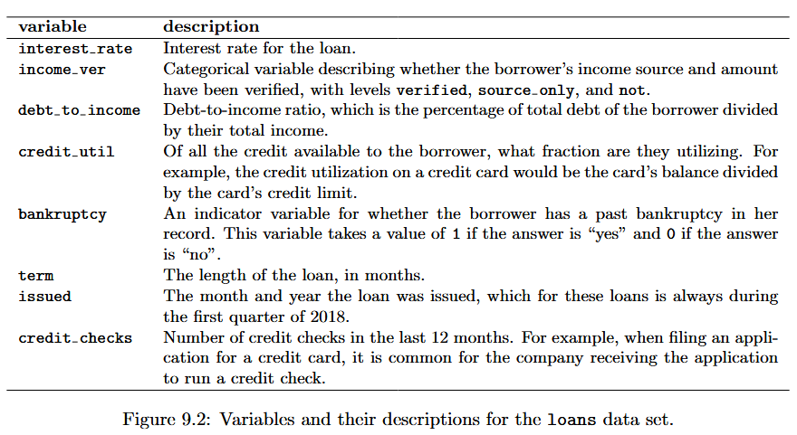

# Unit 4 Notes | Statistics for Business II

## Linear Regression

- Linear regression is the statistical method for fitting a line to data where the relationship between two variables, $x$ and $y$, can be modeled by a straight line with some error
    - $\beta_0$ = y-intercept
    - $\beta_1$ = slope
    - $\epsilon$ = error term (a.k.a residual)

$$
y = \beta_0 + \beta_1 x + \epsilon
$$

- When we use $x$ to predict $y$, we usually call:
    - $x$ the explanatory, predictor or independent variable, 
    - $y$ the response or dependent variable


### Example 1: Opposums...?

```{r}

## read in data
x <- read.csv("data/opossum.csv")
head(x)

## linear regression
lm1 <- lm(head_l ~ total_l, x)
coefficients(lm1)

```

- The **slope** describes the estimated difference in the y variable if the explanatory variable x was **one** unit larger.
    - 0.57 (cm?) larger opossum skull for every 1 (cm?) increase in height, on average
  
- The intercept describes the average outcome of y if **x = 0** and the linear model is valid all the way to x = 0 (which in many applications is not the case!)

```{r}

## range of outcomes
summary(x$total_l)
xs <- seq(70, 100, 1)

## predicted values
b0 <- coefficients(lm1)[1]
b1 <- coefficients(lm1)[2]
y_hat <- b0 + b1 * xs

## combines Xs and predicted values
z <- data.frame(
  x = xs,
  y_hat = round(y_hat, 1)
  )
head(z)

## plot
par(mar = c(4.5, 4.5, 1, 1))
plot(x$total_l, x$head_l,
     xlab = "Total Length of Opossum (cm)",
     ylab = "Length of Opossum's Head (cm)",
     cex.lab = 1.2, cex.axis = 1.1)
lines(xs, y_hat, lwd = 2)
legend("topleft",
       legend = "Line of best fit",
       lwd = 2, cex = 1.2, bty = 'n')

```

### Residuals

$$
Data = Fit + Residual
$$

- Residuals are the leftover variation after accounting fo the model fit

$$
\epsilon_i = y_i - \hat{y_i}
$$


```{r}

## simplify data
p <- data.frame(
  x = x$total_l,
  y = x$head_l,
  y_hat = predict(lm1)
)

## calculate residual
p$residual <- p$y - p$y_hat

## peak at data
head(p)

## plot
par(mar = c(4.5, 4.5, 1, 1))
plot(x$total_l, x$head_l,
     xlab = "Total Length of Opossum (cm)",
     ylab = "Length of Opossum's Head (cm)",
     cex.lab = 1.2, cex.axis = 1.1)
lines(xs, y_hat, lwd = 2)
segments(p$x, p$y, p$x, p$y_hat, lty = 2)
legend("topleft",
       legend = c("Line of best fit",
                  "Residuals"),
       lwd = 2, lty = c(1,2), cex = 1.2, bty = 'n')

## plot
par(mar = c(4.5, 4.5, 1, 1))
plot(p$x, p$residual,
     xlab = "Total Length of Opossum (cm)",
     ylab = "Residuals",
     cex.lab = 1.2, cex.axis = 1.1)
abline(h = 0, lty = 2, lwd = 2)
```

### Correlation

$$
R = \dfrac{1}{n-1} \sum_{i=1}^n \dfrac{x_i - \bar{x}}{s_x} \dfrac{y_i - \bar{y}}{s_y}
$$

- Correlation describes the strength of the linear relationship between two variables
  - We denote the correlation by $R$
  - Always takes values between -1 and 1
  


```{r}

## calculate by hand
zx <- (x$total_l - mean(x$total_l)) / sd(x$total_l)
zy <- (x$head_l - mean(x$head_l)) / sd(x$head_l)
sum(zx * zy)/ (nrow(x) - 1)

## calculate using the function in R
cor(x$head_l, x$total_l)

```

### Conditions for the least squares line

- OLS: "Line of best fit"

- We begin by thinking about what we mean by “best”
    - Mathematically, we want a line that minimizes the magnitude of residuals
    - Most commonly, this is done by **minimizing the sum of the squared residuals**
  
$$
min_{\hat{\beta_0}, \hat{\beta_1}} \sum_{i=1}^n e_i^2 = min_{\hat{\beta_0}, \hat{\beta_1}} \sum_{i=1}^n (y_i - \hat{\beta_0} - \hat{\beta_1}x_i)^2
$$

- **Linearity**: The data should show a linear trend

- **Normal residuals**: Generally, the residuals must be nearly normal. When this condition is found to be unreasonable, it is usually because of outliers or concerns about influential points

- **Constant variability**: The variability of points around the least squares line remains roughly constant

- **Independent observations**: Be cautious about applying regression to time series data, which are sequential observations in time such as a stock price each day


### Example 2: Elmhurst College

```{r}

## read in data
x <- read.csv("data/elmhurst.csv")
head(x)

## OLS
lm2 <- lm(gift_aid ~ family_income, x)
coefficients(lm2)

## beta1 and beta0
b0 <- coefficients(lm2)[1]
b1 <- coefficients(lm2)[2]

# plot x and y
plot(x$family_income, x$gift_aid,
     xlab = "Family Income (per $1k)",
     ylab = "Gift Aid (per $1k)",
     cex.axis = 1.25, cex.lab = 1.5)
abline(lm2, lwd = 2)
legend("topright",
       legend = "Line of Best Fit",
       lwd = 2, cex = 1.25, bty = 'n')

## simplify
y <- data.frame(
  x = x$family_income,
  y = x$gift_aid,
  y_hat = predict(lm2)
)

## calculate residuals
y$residuals <- y$y - y$y_hat

## peak at data
head(y)

## plot residuals distribution
hist(y$residuals, main = "",
     xlab = "Residuals", 
     cex.axis = 1.25, cex.lab = 1.5)

## plot residuals and x
plot(y$x, y$residuals,
     xlab = "Family Income (per $1k)",
     ylab = "Residuals",
     cex.axis = 1.25, cex.lab = 1.5)
abline(h = 0, lty = 2)

```

### Slope

$$b_1 = \dfrac{s_y}{s_x} R$$

```{r}

## correlation
r <- cor(x$gift_aid, x$family_income)
r

# beta 1, by hand
sd_y <- sd(x$gift_aid)
sd_x <- sd(x$family_income)
sd_y / sd_x * r

## beta 1, by R
coefficients(lm2)[2]
```

### Intercept

$$
y - y_0 = m \times (x - x_0)
$$

- You might recall the point-slope form of a line from math class, which we can use to find the model fit, including the estimate of $\beta_0$

$$
y - \bar{y} = \beta_1 \times (x - \bar{x})
$$

- To find the y-intercept, set $x = 0$

$$
b_0 = \bar{y} - \beta_1 \bar{x}
$$

```{r}

## beta0, by hand
mean_y <- mean(x$gift_aid)
mean_x <- mean(x$family_income)
(mean_y - b1*mean_x)

# beta0, by R
coefficients(lm2)[1]

```

### Extrapolation

- Applying a model estimate to values outside of the realm of the original data is called **extrapolation**.
  - If we extrapolate, we are making an unreliable bet that the approximate linear relationship will be valid in places where it has not been analyzed.


### Strength of a fit: R-squared

- We evaluated the strength of the linear relationship between two variables earlier using the
correlation, $R$. 
  - However, it is more common to explain the strength of a linear fit using $R^2$
  - If provided with a linear model, we might like to describe how closely the data cluster around the linear fit.

$$
R^2 = \dfrac{s_y^2 - s_\epsilon^2}{s_y^2}
$$

```{r}

## R2 by hand
sy2 <- sd(y$y)^2
se2 <- sd(y$residuals)^2
(sy2 - se2) / sy2

## R2 by R
summary(lm2)$r.squared

```

- About 25% of the variation in gift aid can be explained by differences in family income.

### Example 3: Mario Kart

```{r}

## read in data
x <- read.csv("data/mariokart.csv")

## clean up data
y <- data.frame(
  new = ifelse(x$cond == "new", 1, 0),
  price = x$total_pr
)
summary(y)

## standardize outcome
z <- (y$price - mean(y$price)) / sd(y$price)

## remove outliers
y <- y[z <= 2.576,]

## run regression
lm3 <- lm(price ~ new, y)
coefficients(lm3)

## fitted values
y$y_hat <- predict(lm3, y)
y$residuals <- y$price - y$y_hat

## density of residuals and x
d_old <- density(y$residuals[y$new == 0])
d_new <- density(y$residuals[y$new == 1])

## plot residuals and x
par(mar = c(4.5, 4.5, 1, 1))
plot(d_old$x, d_old$y, 
     type = "l", lwd = 2,
     xlab = "Residuals", ylab = "Density",
     cex.lab = 1.5, cex.axis = 1.25)
lines(d_new$x, d_new$y, lty = 2, lwd = 2)
legend("topright",
       legend = c("Old", "New"),
       lwd = 2, lty = c(1,2),
       cex = 1.25, bty = "n")

## plot x and y
plot(y$new, y$price,
     xlim = c(-0.25, 1.25),
     xlab = "Condition", ylab = "Selling Price",
     xaxt = 'n', cex.axis = 1.25, cex.lab = 1.5)
axis(1, at = c(0,1), labels = c("Used", "New"), cex.axis = 1.25)
abline(lm3, lwd = 3)

## summarize
summary(lm3)

```

- The estimated intercept is the value of the response variable for the first category.
  - The intercept is the estimated price when $new$ takes value 0, i.e. when the game is in used condition.
  - That is, the average selling price of a used version of the game is \$42.87.

- The estimated slope is the average change in the response variable between the two categories.
  - The slope indicates that, on average, new games sell for about \$10.90 more than used games.

### Example 4: Midterm elections

- **Context:** U.S. House elections occur every two years; those held **midway through a presidential term** are called **midterms**. 

- **Theory:** When **unemployment is high**, the **President’s party performs worse** in midterms.  

- **Approach:** Use **historical data (1898–2018)** (excluding **Great Depression** years) to test whether **unemployment predicts midterm losses**.


  
- $H_0: \beta_1 = 0$
- $H_A: \beta_1 \neq 0$

```{r}

## read in data
x <- read.csv("data/midterms_house.csv")
head(x)

# standardize outcome
z <- (x$unemp - mean(x$unemp)) / sd(x$unemp)

## remove outliers
x <- x[z <= 2.576,]

## run regression
lm4 <- lm(house_change ~ unemp, x)
coefficients(lm4)

## plot
par(mar = c(4.5, 4.5, 1, 1))
plot(x$unemp[x$party == "Republican"], 
     x$house_change[x$party == "Republican"],
     xlab = "Unemployment Rate", ylab = "% Change in Pres. Party",
     cex.lab = 1.5, cex.axis = 1.25, pch = 19, col = "red")
points(x$unemp[x$party == "Democrat"], 
       x$house_change[x$party == "Democrat"], 
       pch = 17, col = "blue")
abline(lm4, lwd = 2)
legend("topright",
       legend = c("Democrats",
                  "Republicans"),
       pch = c(17, 19), col = c("blue", "red"),
       bty = "n")


## standard deviations
sd_x <- sd(x$unemp)
sd_y <- sd(x$house_change)

## set up loop
n <- nrow(x)
z <- list()

## loop
for(i in 1:10000){
  
  set.seed(i)
  
  ## generate data
  ### note that we assume that there is no difference in means (null)
  y <- data.frame(
    x = rnorm(n, mean = 0, sd = sd_x),
    y = rnorm(n, mean = 0, sd = sd_y)
  )
  
  ## store b1
  z[[length(z)+1]] <- coefficients(lm(y ~ x, y))[2]
  
}

## unlist
z <- unlist(z)

## density of generated b1
dz <- density(z)

## plot generated b1s
plot(dz$x, dz$y, type = "l", lwd = 2,
     ylab = "Density", xlab = "Simulated B1 Coefs.",
     cex.axis = 1.25, cex.lab = 1.5)

## real b1
b1 <- as.numeric(coefficients(lm4)[2])

## plot real b1
abline(v = c(-b1, b1), lty = 2, lwd = 2)

## RHS
x_fill <- dz$x[dz$x <= b1]
y_fill <- dz$y[dz$x <= b1]
polygon(c(min(x_fill), x_fill, b1),
        c(0, y_fill, 0),
        col = rgb(0, 0, 1, 0.3), border = NA)

## LHS
x_fill <- dz$x[dz$x >= -b1]
y_fill <- dz$y[dz$x >= -b1]
polygon(c(min(x_fill), x_fill, -b1),
        c(0, y_fill, 0),
        col = rgb(0, 0, 1, 0.3), border = NA)

## p-value on figure
text(b1-1.25, 0.25, 
     paste("p =", round(mean(ifelse(b1 >= z, 1, 0))*2, 3)))

## p-value from simulation
mean(ifelse(b1 >= z, 1, 0))*2

## p-value from R (for b1)
summary(lm4)

```

## Multiple Regression

- **Multiple regression** extends simple two-variable regression to situations with one response variable and multiple predictors (denoted $x_1$, $x_2$, $x_3$, …). 
  - It is motivated by cases where several factors may simultaneously influence an outcome

- A multiple regression model is a linear model with multiple predictors  In general, we write the model as... where there are $k$ predictors

$$
\hat{y} = \beta_0 + \beta_1 x_1 + \beta_2 x_2 + \dots + \beta_k x_k
$$

### Example 1: Bankruptcy

- We will consider data on loans from the peer-to-peer lender, Lending Club.
- The dataset includes both **loan characteristics** and **borrower information**.  
  - Our goal is to understand the factors that influence the **interest rate assigned to each loan**.

- Holding all other characteristics constant:
  - Does it matter **how much debt someone already has**?  
  - Does it matter **whether their income has been verified**?



```{r}

## read in data
x <- read.csv("data/loans_full_schema.csv")
dim(x)

# simplify
y <- data.frame(
  interest_rate = x$interest_rate,
  income_ver = x$verified_income,
  debt_to_income = x$debt_to_income,
  credit_util = x$total_credit_utilized / x$total_credit_limit,
  bankruptcy = ifelse(x$public_record_bankrupt > 0, 1, 0),
  term = x$term,
  issued = x$issue_month,
  credit_checks = x$inquiries_last_12m
)

## peak at data
head(y)

# run regression
lm1 <- lm(interest_rate ~ bankruptcy, data = y)
summary(lm1)

## aggregate data
z <- aggregate(interest_rate ~ bankruptcy, y, 
               function(x) c(mean = mean(x),
                             sd = sd(x),
                             n = length(x)))
z <- as.data.frame(do.call(cbind, z))

## add C.I.s
z$min <- z$mean - 1.96 * z$sd / sqrt(z$n)
z$max <- z$mean + 1.96 * z$sd / sqrt(z$n)
z

# b1
z$mean[2] - z$mean[1]

## plot
plot(z$bankruptcy, z$mean,
     ylim = c(min(z$min), max(z$max)),
     xlim = c(-0.25, 1.25), pch = 19, cex = 1.25,
     ylab = "Mean Interest Rate", xlab = "Bankruptcy",
     cex.lab = 1.5, cex.axis = 1.25)
arrows(z$bankruptcy, z$min, z$bankruptcy, z$max,
       angle = 90, code = 3, length = 0.05, lwd = 2)

## run regression
lm2 <- lm(interest_rate ~ income_ver, data = y)
summary(lm2)

## aggregate
z <- aggregate(interest_rate ~ income_ver, y, 
               function(x) c(mean = mean(x),
                             sd = sd(x),
                             n = length(x)))
z <- as.data.frame(do.call(cbind, z))
z[,2:4] <- apply(z[,2:4], 2, as.numeric)
z$min <- z$mean - 1.96 * z$sd / sqrt(z$n)
z$max <- z$mean + 1.96 * z$sd / sqrt(z$n)
z

## b1
z$mean[2] - z$mean[1]

## b2
z$mean[3] - z$mean[1]

```

- This regression output provides multiple rows for the **income verification** variable.  
  - Each row represents the relative difference for each level of `income_ver`.  

- However, one level is missing: *Not Verified*.  
  - The missing level is called the **reference group**, representing the default category that all other levels are measured against.

- The higher interest rate for borrowers who have verified their income is surprising.  
  - Intuitively, we might expect verified income to make a loan **less risky**.  

- However, the situation may be more complex and could involve **confounding variables** that we haven’t accounted for.  
  - For example, perhaps lenders require borrowers with **poor credit** to verify their income. In that case, income verification could signal *concern about repayment* rather than *reassurance*. This would make the borrower appear higher risk, leading to a higher interest rate.

- **Omitted variable bias** occurs when a model leaves out relevant variables, leading to **biased or misleading estimates** of the included predictors.  
  - The effects of the missing variables are incorrectly attributed to those remaining in the model, distorting interpretation.

```{r}

## run regression
lm3 <- lm(interest_rate ~ income_ver + debt_to_income + credit_util + bankruptcy + term + issued + credit_checks, data = y)

## summarize
summary(lm3)

```

- We estimate the parameters $\beta_0, \beta_1, \beta_2...,\beta_9$ that minimize the sum of the squared residuals:

$$
SSE = e_1^2 + e_2^2 + ... + e_{10,000}^2 = \sum_{i=1}^{10,000} e_i^2 = \sum_{i=1}^{10,000} (y_i - \hat{y_i})^2
$$

- Each coefficient represents the **incremental change** in interest rate for that level, relative to the *Not Verified* group, which serves as the **reference level**.  
  - For example, a borrower whose income source and amount have been verified is predicted to have a **3.25 percentage point higher** interest rate than a borrower whose income has not been verified.

- The estimated **intercept** is **1.925**, and one might be tempted to interpret this as the model’s **predicted interest rate when all predictors equal zero** — i.e., income source not verified, no debt, zero credit utilization, and so on. 
  - **term** (the length of the loan in months) never equals zero — a loan with a term of 0 months would have to be repaid immediately...
  - Therefore, in this context, **the intercept has little practical meaning** and should not be over-interpreted.

### Collinearity

- Including multiple predictors helps reduce or eliminate **omitted variable bias**, but another challenge can arise: **correlation among predictors**.  
  - When two or more predictors are correlated, we say they are **collinear**.  
  - This **collinearity** makes it difficult to disentangle each variable’s individual contribution to the response, and can complicate model estimation and interpretation.

```{r}
## correlation matrix 
round(cor(y[complete.cases(y),-c(1, 2, 7)]), 2)
```

### Adjusted R-Squared

- The regular $R^2$ often **overstates** how much variability the model explains, especially for new samples.
  - To obtain a more reliable measure of model fit, we use the **adjusted $R^2$**, which penalizes unnecessary predictors and better reflects **true explanatory power**.

$$
R_{adj}^2 = 1 - (1 - R^2) \times \dfrac{n - 1}{n - k - 1}
$$

```{r}

## remove observations with missing data
y1 <- y[complete.cases(y),]

## r2 by hand
r2 <- (var(y1$interest_rate) - var(lm3$residuals)) / var(y1$interest_rate)
r2

## r2 by computer
summary(lm3)$r.squared

## adj. r2 by hand
n <- nrow(y1)
k <- length(coefficients(lm3)) - 1
adj_r2 <- 1 - (1 - r2) * (n - 1) / (n - k - 1)
adj_r2

## adj. by computer
summary(lm3)$adj.r.squared
```

### Model Selection

- The **best model** is not always the most complicated.  
    - Including variables that are not truly important can actually **reduce predictive accuracy**.  
    - Models that have undergone such variable pruning are often called **parsimonious models** — a term that simply means *efficient and no more complex than necessary*.  

- Our goal is to identify a **smaller, more interpretable model** that performs just as wellor better than a "full" model.
  - **Adjusted $R^2$** measures the strength of a model’s fit while penalizing unnecessary predictors.  

- **Backward elimination** begins with the **full model**, which includes all potential predictors.     
  - Variables are removed **one at a time** until no further improvement in **adjusted $R^2$** is possible.  

```{r}

## full model
lm3 <- lm(interest_rate ~ income_ver + debt_to_income + credit_util + bankruptcy + term + issued + credit_checks, data = y)

## drop 'issued'
lm4 <- lm(interest_rate ~ income_ver + debt_to_income + credit_util + bankruptcy + term + credit_checks, data = y)

## small improvement in r2
(summary(lm4)$adj.r.squared - summary(lm3)$adj.r.squared)*10000

## drop 'bankruptcy'
lm5 <- lm(interest_rate ~ income_ver + debt_to_income + credit_util + term + credit_checks, data = y)

## small decline in r2
### lm4 is "best"
(summary(lm5)$adj.r.squared - summary(lm4)$adj.r.squared)*10000

## are residuals normal?
hist(lm4$residuals, xlab = "Residuals", cex.axis = 1.25, cex.lab = 1.5, main = "")

## is the variability of the residuals is nearly constant?
z <- data.frame(
  fitted_values = predict(lm4),
  abs_residuals = abs(lm4$residuals)
)
lm5 <- lm(abs_residuals ~ fitted_values, z)
summary(lm5)

## are the residuals independent?
plot(z$fitted_values, z$abs_residuals, col = "blue", pch = 19,
     xlab = "Fitted Values", ylab = "Abs. Value of Residuals",
     cex.axis = 1.25, cex.lab = 1.5)
abline(lm5, lwd = 2, lty = 2)

### outliers
z <- data.frame(
  z1 = y1$debt_to_income,
  z2 = y1$credit_util,
  z3 = y1$credit_checks
)

for(i in 1:ncol(z)){
  z[,i] <- (z[,i] - mean(z[,i])) / sd(z[,i])
}

d1 <- density(z[,1])
d2 <- density(z[,2])
d3 <- density(z[,3])

jump <- max(c(d1$y, d2$y, d3$y))*1.15
z <- data.frame(
  x = c(d1$x, NA, d2$x, NA, d3$x),
  y = c(d1$y, NA, d2$y + jump, NA, d3$y + jump * 2)
)

par(mfrow = c(1, 1), mar = c(4.5, 9, 1, 1))
plot(z$x, z$y, type = "l", lwd = 2,
     ylab = "", yaxt = 'n',
     xlab = "Z-scores", cex.axis = 1.25, cex.lab = 1.5)
abline(h = c(0, jump, jump*2), lty = 2, col = "lightgrey")
axis(2, at = c(0, jump, jump*2), 
     labels = c("Debt to Income", "Credit Util.", "Credit Checks"), 
     cex.axis = 1.25, las = 1)

```

- The main concern for the initial model is that there is a notable nonlinear relationship between the debt-to-income variable 
  - To resolve this issue, we’re going to consider a couple strategies for adjusting the relationship between the predictor variable and the outcome.

- Below are several options:
  - log transformation ($log(x)$),
  - square root transformation ($\sqrt{x}$),
  - truncation (cap the max value possible)
  - subsetting (dropping all observations beyond a max value)

```{r}

par(mfrow = c(2,2), mar = c(4.5, 4.5, 1, 1))

plot(log(y1$debt_to_income), y1$residuals,
     xlab = "log(Debt to Income)", ylab = "Residuals",
     cex.lab = 1.5, cex.axis = 1.25)

plot(sqrt(y1$debt_to_income), y1$residuals,
     xlab = "sqrt(Debt to Income)", ylab = "Residuals",
     cex.lab = 1.5, cex.axis = 1.25)

plot(ifelse(y1$debt_to_income > 50, 50, y1$debt_to_income), y1$residuals,
     xlab = "Debt to Income (Truncated)", ylab = "Residuals",
     cex.lab = 1.5, cex.axis = 1.25)

plot(y1$debt_to_income[y1$debt_to_income <= 50], 
     y1$residuals[y1$debt_to_income <= 50],
     xlab = "Debt to Income (< 50)", ylab = "Residuals",
     cex.lab = 1.5, cex.axis = 1.25)

## subset
y2 <- subset(y1, y1$debt_to_income < 50)

## run regression
lm4_subset <- lm(interest_rate ~ income_ver + debt_to_income + credit_util + bankruptcy + term + credit_checks, data = y2)

## summarize
summary(lm4_subset)
```
