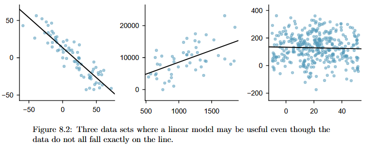
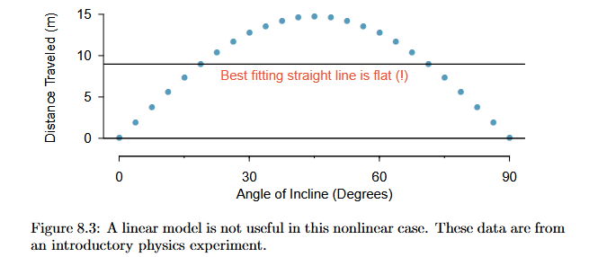
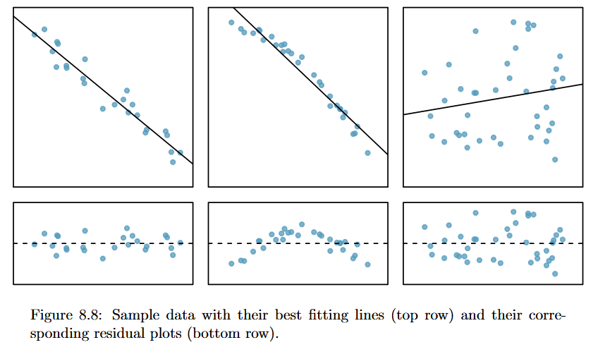
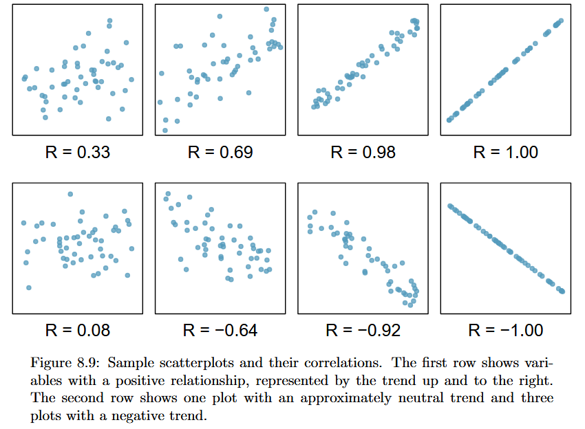
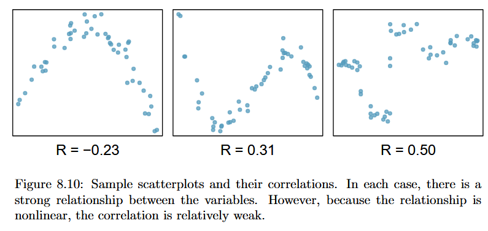
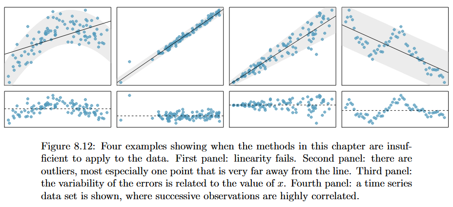

# Unit 4 Notes | Statistics for Business II

## Linear Regression

- Linear regression is the statistical method for fitting a line to data where the relationship between two variables, $x$ and $y$, can be modeled by a straight line with some error
    - $\beta_0$ = y-intercept
    - $\beta_1$ = slope
    - $\epsilon$ = error term (a.k.a residual)

$$
y = \beta_0 + \beta_1 x + \epsilon
$$

- When we use $x$ to predict $y$, we usually call:
    - $x$ the explanatory, predictor or independent variable, 
    - $y$ the response or dependent variable





### Example 1: Opposums...?

```{r}

## read in data
x <- read.csv("data/opossum.csv")
head(x)

## linear regression
lm1 <- lm(head_l ~ total_l, x)
coefficients(lm1)

```

- The **slope** describes the estimated difference in the y variable if the explanatory variable x was **one** unit larger.
    - 0.57 (cm?) larger opossum skull for every 1 (cm?) increase in height, on average
  
- The intercept describes the average outcome of y if **x = 0** and the linear model is valid all the way to x = 0 (which in many applications is not the case!)

```{r}

## range of outcomes
summary(x$total_l)
xs <- seq(70, 100, 1)

## predicted values
b0 <- coefficients(lm1)[1]
b1 <- coefficients(lm1)[2]
y_hat <- b0 + b1 * xs

## combines Xs and predicted values
z <- data.frame(
  x = xs,
  y_hat = round(y_hat, 1)
  )
head(z)

## plot
par(mar = c(4.5, 4.5, 1, 1))
plot(x$total_l, x$head_l,
     xlab = "Total Length of Opossum (cm)",
     ylab = "Length of Opossum's Head (cm)",
     cex.lab = 1.2, cex.axis = 1.1)
lines(xs, y_hat, lwd = 2)
legend("topleft",
       legend = "Line of best fit",
       lwd = 2, cex = 1.2, bty = 'n')

```

### Residuals

$$
Data = Fit + Residual
$$

- Residuals are the leftover variation after accounting fo the model fit

$$
\epsilon_i = y_i - \hat{y_i}
$$



```{r}

## simplify data
p <- data.frame(
  x = x$total_l,
  y = x$head_l,
  y_hat = predict(lm1)
)

## calculate residual
p$residual <- p$y - p$y_hat

## peak at data
head(p)

## plot
par(mar = c(4.5, 4.5, 1, 1))
plot(x$total_l, x$head_l,
     xlab = "Total Length of Opossum (cm)",
     ylab = "Length of Opossum's Head (cm)",
     cex.lab = 1.2, cex.axis = 1.1)
lines(xs, y_hat, lwd = 2)
segments(p$x, p$y, p$x, p$y_hat, lty = 2)
legend("topleft",
       legend = c("Line of best fit",
                  "Residuals"),
       lwd = 2, lty = c(1,2), cex = 1.2, bty = 'n')

## plot
par(mar = c(4.5, 4.5, 1, 1))
plot(p$x, p$residual,
     xlab = "Total Length of Opossum (cm)",
     ylab = "Residuals",
     cex.lab = 1.2, cex.axis = 1.1)
abline(h = 0, lty = 2, lwd = 2)
```

### Correlation

$$
R = \dfrac{1}{n-1} \sum_{i=1}^n \dfrac{x_i - \bar{x}}{s_x} \dfrac{y_i - \bar{y}}{s_y}
$$

- Correlation describes the strength of the linear relationship between two variables
  - We denote the correlation by $R$
  - Always takes values between -1 and 1
  




```{r}

## calculate by hand
zx <- (x$total_l - mean(x$total_l)) / sd(x$total_l)
zy <- (x$head_l - mean(x$head_l)) / sd(x$head_l)
sum(zx * zy)/ (nrow(x) - 1)

## calculate using the function in R
cor(x$head_l, x$total_l)

```

### Conditions for the least squares line

- OLS: "Line of best fit"

- We begin by thinking about what we mean by “best”
    - Mathematically, we want a line that minimizes the magnitude of residuals
    - Most commonly, this is done by **minimizing the sum of the squared residuals**
  
$$
min_{\hat{\beta_0}, \hat{\beta_1}} \sum_{i=1}^n e_i^2 = min_{\hat{\beta_0}, \hat{\beta_1}} \sum_{i=1}^n (y_i - \hat{\beta_0} - \hat{\beta_1}x_i)^2
$$

- **Linearity**: The data should show a linear trend

- **Normal residuals**: Generally, the residuals must be nearly normal. When this condition is found to be unreasonable, it is usually because of outliers or concerns about influential points

- **Constant variability**: The variability of points around the least squares line remains roughly constant

- **Independent observations**: Be cautious about applying regression to time series data, which are sequential observations in time such as a stock price each day



### Example 2: Elmhurst College

```{r}

## read in data
x <- read.csv("data/elmhurst.csv")
head(x)

## OLS
lm2 <- lm(gift_aid ~ family_income, x)
coefficients(lm2)

## beta1 and beta0
b0 <- coefficients(lm2)[1]
b1 <- coefficients(lm2)[2]

# plot x and y
plot(x$family_income, x$gift_aid,
     xlab = "Family Income (per $1k)",
     ylab = "Gift Aid (per $1k)",
     cex.axis = 1.25, cex.lab = 1.5)
abline(lm2, lwd = 2)
legend("topright",
       legend = "Line of Best Fit",
       lwd = 2, cex = 1.25, bty = 'n')

## simplify
y <- data.frame(
  x = x$family_income,
  y = x$gift_aid,
  y_hat = predict(lm2)
)

## calculate residuals
y$residuals <- y$y - y$y_hat

## peak at data
head(y)

## plot residuals distribution
hist(y$residuals, main = "",
     xlab = "Residuals", 
     cex.axis = 1.25, cex.lab = 1.5)

## plot residuals and x
plot(y$x, y$residuals,
     xlab = "Family Income (per $1k)",
     ylab = "Residuals",
     cex.axis = 1.25, cex.lab = 1.5)
abline(h = 0, lty = 2)

```

### Slope

$$b_1 = \dfrac{s_y}{s_x} R$$

```{r}

## correlation
r <- cor(x$gift_aid, x$family_income)
r

# beta 1, by hand
sd_y <- sd(x$gift_aid)
sd_x <- sd(x$family_income)
sd_y / sd_x * r

## beta 1, by R
coefficients(lm2)[2]
```

### Intercept

$$
y - y_0 = m \times (x - x_0)
$$

- You might recall the point-slope form of a line from math class, which we can use to find the model fit, including the estimate of $\beta_0$

$$
y - \bar{y} = \beta_1 \times (x - \bar{x})
$$

- To find the y-intercept, set $x = 0$

$$
b_0 = \bar{y} - \beta_1 \bar{x}
$$

```{r}

## beta0, by hand
mean_y <- mean(x$gift_aid)
mean_x <- mean(x$family_income)
(mean_y - b1*mean_x)

# beta0, by R
coefficients(lm2)[1]

```
